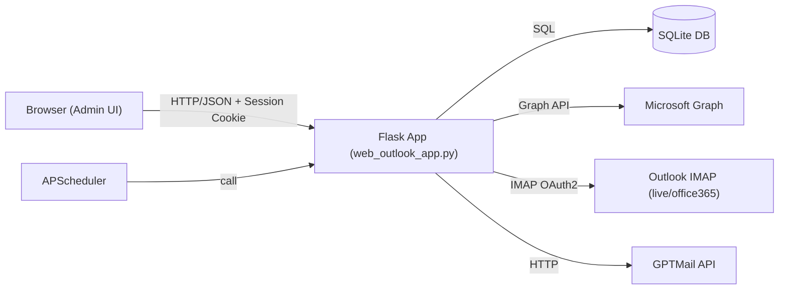
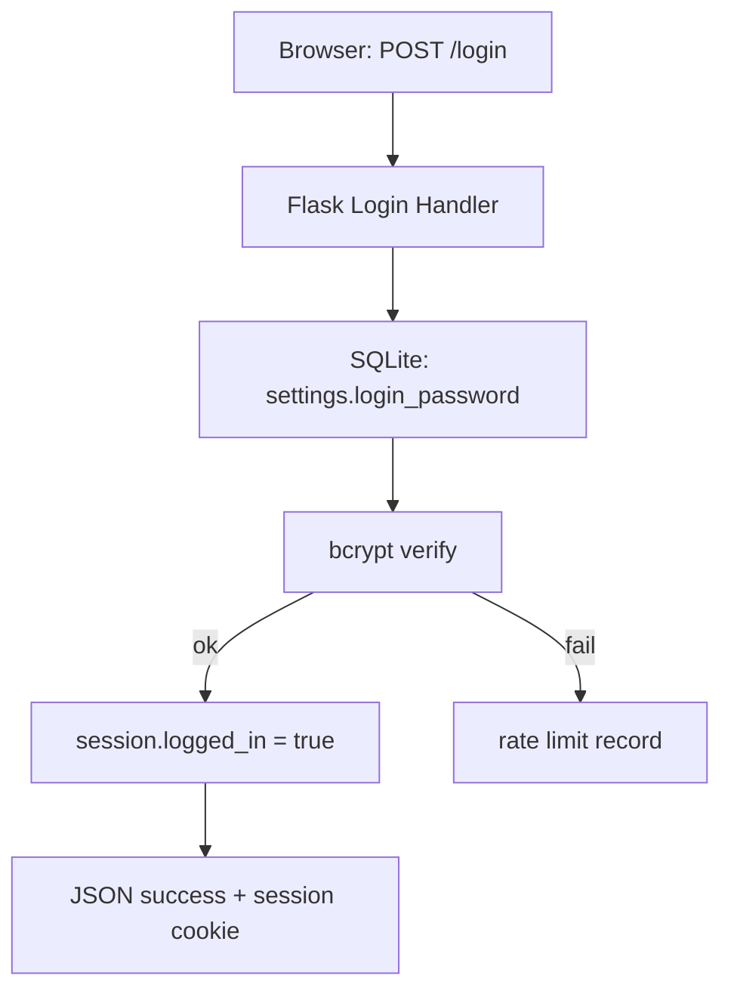
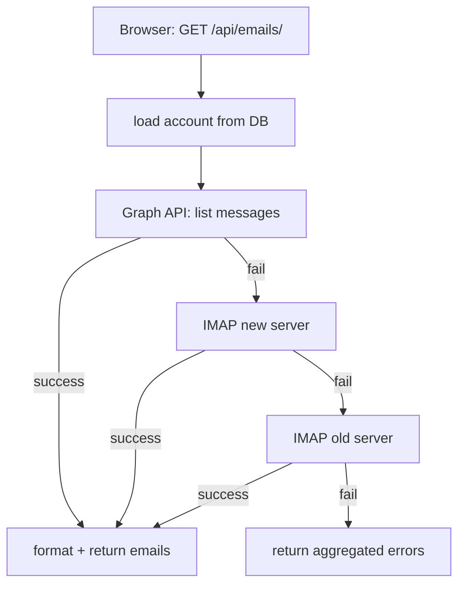
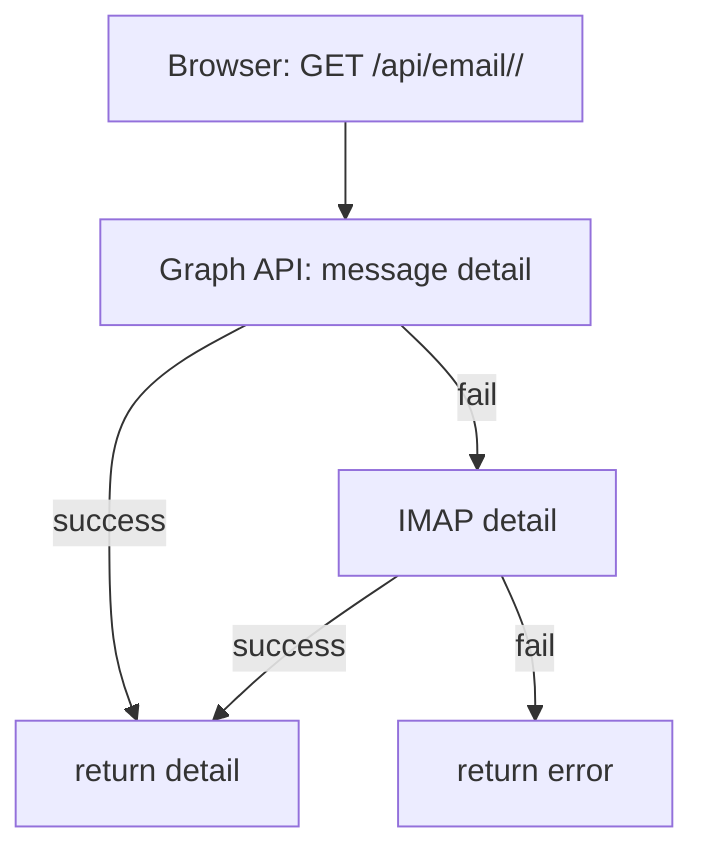
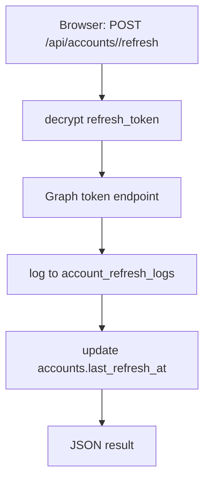
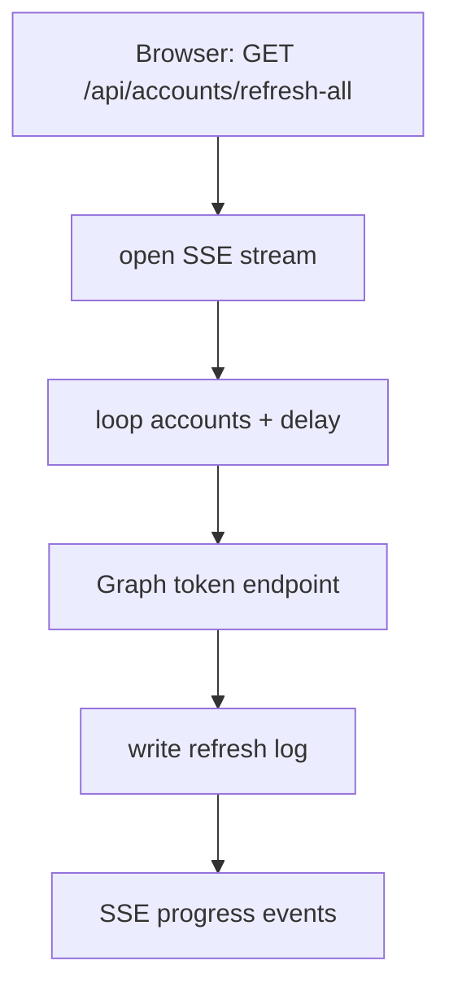
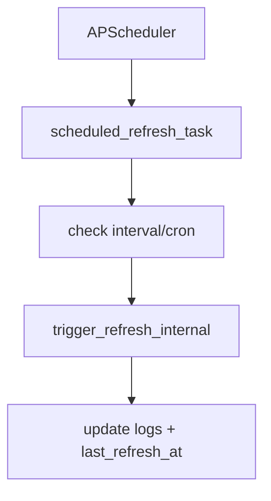
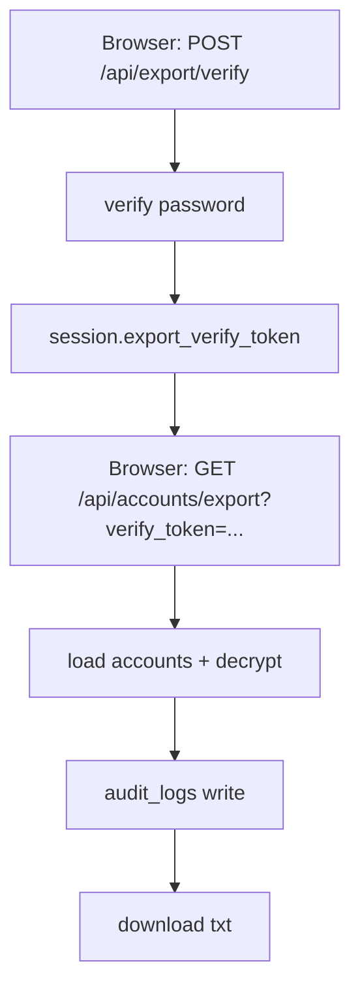

# 架构与数据流

本页聚焦系统组件关系与关键业务数据流，配合 `PROJECT_ANALYSIS.md` 使用。

## 组件架构

## 数据流一：登录与会话

## 数据流二：获取邮件列表（Graph 优先）

## 数据流三：邮件详情

## 数据流四：Token 刷新

**手动刷新（单账号）**

**全量刷新（SSE）**

**定时刷新**

## 数据流五：导出账号

## 前端缓存边界

- 邮件列表缓存存在浏览器内存（按 `account + folder` 维度）。
- 后端邮件 API 不做缓存，每次请求都会向 Graph/IMAP 获取。

## 关键依赖边界

- `SECRET_KEY` 一旦变更，将导致已加密的 `refresh_token`/`password` 无法解密。
- 生产场景建议将 DB 与 `SECRET_KEY` 一同持久化与备份。

