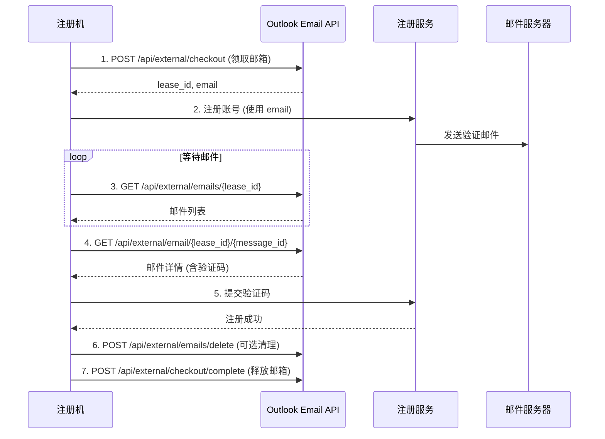

# 外部 API 文档

本文档描述用于外部注册机自动化的 API 接口。

## 认证

所有外部 API 需要在请求头中携带 API Key：

```
X-API-Key: <your-SECRET_KEY>
```

API Key 即为环境变量 `SECRET_KEY` 的值。

## 完整注册流程



## API 端点

### 1. 领取邮箱

**请求**
```http
POST /api/external/checkout
X-API-Key: <your-secret-key>
Content-Type: application/json

{
  "owner": "bot_1",           // 可选：标识使用者
  "ttl_seconds": 900          // 可选：租约时长(60-3600秒，默认900)
}
```

**响应（成功）**
```json
{
  "success": true,
  "lease_id": "abc123def456...",
  "account_id": 42,
  "email": "example@outlook.com",
  "expires_at": "2026-02-09 10:15:00"
}
```

**响应（无可用邮箱）**
```json
{
  "success": false,
  "error": "没有可用邮箱"
}
```

**说明**：
- 自动选择第一个未被租用的 `active` 状态账号
- 创建租约记录，防止并发冲突
- 租约到期后自动释放

---

### 2. 获取账号完整信息

**请求**
```http
GET /api/external/account/{lease_id}
X-API-Key: <your-secret-key>
```

**响应**
```json
{
  "success": true,
  "account": {
    "account_id": 42,
    "email": "example@outlook.com",
    "password": "decrypted_password",
    "client_id": "decrypted_client_id",
    "refresh_token": "decrypted_refresh_token",
    "remark": "备注信息",
    "status": "active",
    "lease_expires_at": "2026-02-09 10:15:00"
  }
}
```

**说明**：
- 返回解密后的完整凭据
- 验证租约有效性和过期时间
- 用于需要直接使用账号凭据的场景

---

### 3. 获取邮件列表

**请求**
```http
GET /api/external/emails/{lease_id}?folder=inbox&skip=0&top=20
X-API-Key: <your-secret-key>
```

**查询参数**：
- `folder`: 文件夹名称（`inbox`, `junkemail`, `deleteditems`，默认 `inbox`）
- `skip`: 跳过数量（分页，默认 0）
- `top`: 返回数量（默认 20）

**响应**
```json
{
  "success": true,
  "method": "Graph API",
  "has_more": true,
  "emails": [
    {
      "id": "AAMkAGI...",
      "subject": "验证您的账号",
      "from": "noreply@service.com",
      "date": "2026-02-09T10:05:00Z",
      "is_read": false,
      "has_attachments": false,
      "body_preview": "您的验证码是: 123456"
    }
  ]
}
```

**说明**：
- 优先使用 Graph API，失败时自动降级到 IMAP
- `method` 字段标识实际使用的方法
- 租约过期返回 410 状态码

---

### 4. 获取邮件详情

**请求**
```http
GET /api/external/email/{lease_id}/{message_id}?folder=inbox
X-API-Key: <your-secret-key>
```

**查询参数**：
- `folder`: 文件夹名称（默认 `inbox`）

**响应**
```json
{
  "success": true,
  "method": "Graph API",
  "email": {
    "id": "AAMkAGI...",
    "subject": "验证您的账号",
    "from": "noreply@service.com",
    "to": ["example@outlook.com"],
    "date": "2026-02-09T10:05:00Z",
    "body_type": "html",
    "body": "<html>您的验证码是: <b>123456</b></html>",
    "is_read": false,
    "has_attachments": false
  }
}
```

**说明**：
- 返回完整邮件内容（包括 HTML body）
- 用于提取验证码等关键信息

---

### 5. 删除邮件（可选）

**请求**
```http
POST /api/external/emails/delete
X-API-Key: <your-secret-key>
Content-Type: application/json

{
  "lease_id": "abc123def456...",
  "message_ids": ["AAMkAGI...", "AAMkAGJ..."]
}
```

**响应**
```json
{
  "success": true,
  "success_count": 2,
  "failed_count": 0,
  "errors": []
}
```

**说明**：
- 永久删除邮件（不可恢复）
- 仅支持 Graph API
- 用于清理验证邮件

---

### 6. 释放邮箱

**请求**
```http
POST /api/external/checkout/complete
X-API-Key: <your-secret-key>
Content-Type: application/json

{
  "lease_id": "abc123def456...",
  "result": "success"           // 可选：记录结果
}
```

**响应**
```json
{
  "success": true
}
```

**说明**：
- 删除租约记录，释放邮箱供其他使用
- 即使租约未到期也应主动释放
- `result` 字段用于审计日志

---

## 错误处理

### 通用错误格式

```json
{
  "success": false,
  "error": "错误描述"
}
```

### 常见错误码

| HTTP 状态码 | 说明 |
|------------|------|
| 400 | 参数不完整或格式错误 |
| 401 | API Key 无效或缺失 |
| 404 | 租约不存在或账号不存在 |
| 410 | 租约已过期 |
| 500 | 服务器内部错误 |

---

## 使用示例

### Python 示例

```python
import requests
import time
import re

API_BASE = "http://localhost:5001"
API_KEY = "your-secret-key"

headers = {
    "X-API-Key": API_KEY,
    "Content-Type": "application/json"
}

# 1. 领取邮箱
response = requests.post(
    f"{API_BASE}/api/external/checkout",
    json={"owner": "bot_1", "ttl_seconds": 1800},
    headers=headers
)
data = response.json()
lease_id = data["lease_id"]
email = data["email"]
print(f"领取邮箱: {email}, 租约ID: {lease_id}")

# 2. 使用邮箱注册（调用第三方服务）
# register_to_service(email)

# 3. 等待并获取验证邮件
max_attempts = 30
verification_code = None

for attempt in range(max_attempts):
    time.sleep(10)  # 每10秒检查一次
    
    response = requests.get(
        f"{API_BASE}/api/external/emails/{lease_id}",
        params={"folder": "inbox", "top": 5},
        headers=headers
    )
    
    if response.status_code == 200:
        emails = response.json().get("emails", [])
        
        # 查找验证邮件
        for email_item in emails:
            if "验证" in email_item["subject"] or "verify" in email_item["subject"].lower():
                # 获取邮件详情
                detail_response = requests.get(
                    f"{API_BASE}/api/external/email/{lease_id}/{email_item['id']}",
                    headers=headers
                )
                
                if detail_response.status_code == 200:
                    email_detail = detail_response.json()["email"]
                    body = email_detail["body"]
                    
                    # 提取验证码（假设是6位数字）
                    match = re.search(r'\b\d{6}\b', body)
                    if match:
                        verification_code = match.group()
                        print(f"找到验证码: {verification_code}")
                        break
        
        if verification_code:
            break

# 4. 提交验证码
if verification_code:
    # submit_verification_code(verification_code)
    print(f"验证成功")
    result = "success"
else:
    print("未找到验证码")
    result = "failed"

# 5. 释放邮箱
requests.post(
    f"{API_BASE}/api/external/checkout/complete",
    json={"lease_id": lease_id, "result": result},
    headers=headers
)
print("邮箱已释放")
```

### cURL 示例

```bash
# 1. 领取邮箱
curl -X POST http://localhost:5001/api/external/checkout \
  -H "X-API-Key: your-secret-key" \
  -H "Content-Type: application/json" \
  -d '{"owner": "bot_1", "ttl_seconds": 900}'

# 2. 获取邮件列表
curl -X GET "http://localhost:5001/api/external/emails/abc123?folder=inbox&top=10" \
  -H "X-API-Key: your-secret-key"

# 3. 获取邮件详情
curl -X GET "http://localhost:5001/api/external/email/abc123/AAMkAGI..." \
  -H "X-API-Key: your-secret-key"

# 4. 释放邮箱
curl -X POST http://localhost:5001/api/external/checkout/complete \
  -H "X-API-Key: your-secret-key" \
  -H "Content-Type: application/json" \
  -d '{"lease_id": "abc123", "result": "success"}'
```

---

## 最佳实践

### 1. 租约管理
- 根据注册流程预估时间设置合理的 `ttl_seconds`
- 完成后立即调用 `complete` 释放，不要等待过期
- 处理租约过期的情况（410 错误）

### 2. 邮件轮询
- 使用合理的轮询间隔（建议 5-10 秒）
- 设置最大尝试次数，避免无限等待
- 检查邮件主题和发件人，确保是目标邮件

### 3. 验证码提取
- 使用正则表达式提取验证码
- 支持多种格式（纯数字、字母数字混合等）
- 优先从 `body_preview` 提取，失败时再获取完整邮件

### 4. 错误处理
- 处理所有可能的 HTTP 错误码
- 实现重试机制（指数退避）
- 记录详细日志便于调试

### 5. 并发控制
- 多个注册机实例可并发运行
- 租约机制自动防止冲突
- 监控可用邮箱数量，及时补充

---

## 安全建议

1. **保护 API Key**：
   - 不要在代码中硬编码
   - 使用环境变量或密钥管理服务
   - 定期轮换 SECRET_KEY

2. **网络安全**：
   - 生产环境使用 HTTPS
   - 限制 API 访问 IP（防火墙/反向代理）
   - 考虑添加速率限制

3. **审计日志**：
   - 所有外部 API 调用都会记录到 `audit_logs` 表
   - 定期检查异常访问模式
   - 监控租约使用情况

---

## 故障排查

### 问题：无可用邮箱

**原因**：
- 所有账号都被租用
- 所有账号状态为 `inactive`

**解决**：
- 检查租约表：`SELECT * FROM account_leases`
- 检查账号状态：`SELECT status, COUNT(*) FROM accounts GROUP BY status`
- 清理过期租约或增加账号

### 问题：无法获取邮件

**原因**：
- Token 过期
- Graph API 限流
- IMAP 连接失败

**解决**：
- 检查刷新日志：`SELECT * FROM account_refresh_logs ORDER BY created_at DESC LIMIT 10`
- 手动刷新 Token：`POST /api/accounts/{id}/refresh`
- 查看详细错误信息（`details` 字段）

### 问题：租约过期

**原因**：
- 注册流程耗时超过 `ttl_seconds`
- 网络延迟导致邮件到达慢

**解决**：
- 增加 `ttl_seconds` 值
- 优化注册流程，减少等待时间
- 实现租约续期机制（需自行扩展）

---

## 附录：数据库表结构

### account_leases 表

```sql
CREATE TABLE account_leases (
    lease_id TEXT PRIMARY KEY,
    account_id INTEGER UNIQUE NOT NULL,
    owner TEXT,
    expires_at TIMESTAMP NOT NULL,
    created_at TIMESTAMP DEFAULT CURRENT_TIMESTAMP,
    FOREIGN KEY (account_id) REFERENCES accounts (id) ON DELETE CASCADE
)
```

### audit_logs 表

```sql
CREATE TABLE audit_logs (
    id INTEGER PRIMARY KEY AUTOINCREMENT,
    action TEXT NOT NULL,
    resource_type TEXT NOT NULL,
    resource_id TEXT,
    user_ip TEXT,
    details TEXT,
    created_at TIMESTAMP DEFAULT CURRENT_TIMESTAMP
)
```

外部 API 相关的 `action` 值：
- `checkout`: 领取邮箱
- `checkout_complete`: 释放邮箱
- `external_get_account`: 获取账号信息
- `external_get_emails`: 获取邮件列表
- `external_get_email_detail`: 获取邮件详情
- `external_delete_emails`: 删除邮件
